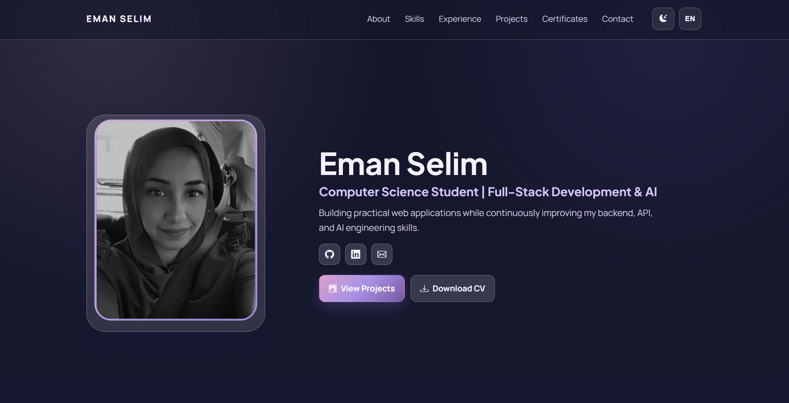

# Eman Selim | Portfolio Website

A modern multilingual portfolio website built with HTML, CSS, and JavaScript.

This project was created as a personal portfolio to present my skills, projects, certificates, and academic background in a clean and responsive design with dark/light mode support and a dynamically generated CV page.

---

## 🌐 Live Demo

[View Portfolio Website](https://eman-m-selim.github.io/portfolio-website/)

---

## 🖼️ Preview



---

## ✨ Features

- Responsive modern UI
- English / German language support
- Dark & Light theme toggle
- Dynamic portfolio data structure
- About & Education section
- Skills & Languages section
- Experience timeline
- Projects showcase
- Certificates page
- Contact section
- Dynamic CV page
- Print / PDF CV export
- GitHub Pages deployment ready

---

## 🛠️ Tech Stack

- HTML5
- CSS3
- Vanilla JavaScript
- Bootstrap Icons
- Git & GitHub
- GitHub Pages

---

## 📂 Project Structure

```text
.
├── assets/
│   └── images/
├── css/
│   ├── style.css
│   └── cv.css
├── js/
│   ├── script.js
│   └── cv.js
├── data/
│   └── portfolio-data.js
├── index.html
├── projects.html
├── certificates.html
├── cv.html
└── README.md
```

---

## 📄 Main Sections

### Home / Hero
Personal introduction with social links and quick actions.

### About
Short professional summary and education timeline.

### Skills
Frontend, backend, AI, tools, methods, soft skills, and language levels.

### Experience
Professional and student work experience displayed as a timeline.

### Projects
Highlighted portfolio projects with technologies and links.

### Certificates
Dedicated page for certifications and learning progress.

### Contact
Contact form, social links, and location information.

### CV
Dynamic printable CV page with PDF export support.

---

## 🧠 Content Management

All portfolio content is managed centrally from:

```text
data/portfolio-data.js
```

This includes:

- Translations (EN / DE)
- Personal information
- Skills
- Experience
- Projects
- Certificates
- CV content

---

## ♿ Accessibility & UX

- Semantic HTML structure
- Responsive layout
- Keyboard-friendly navigation
- Focus-visible states
- Accessible color contrast
- Mobile-friendly navigation
- Print-optimized CV layout

---

## 🚀 Local Development

Clone the repository:

```bash
git clone https://github.com/Eman-M-Selim/portfolio-website.git
```

Open the project folder:

```bash
cd portfolio-website
```

Run a local server (optional):

```bash
python -m http.server 8000
```

or

```bash
npx serve .
```

Then open:

```text
http://localhost:8000
```

---

## 🌍 Deployment

This website is deployed using GitHub Pages.

To deploy:

1. Push the repository to GitHub
2. Open:
   `Settings → Pages`
3. Select:
   - Source → Deploy from a branch
   - Branch → main
   - Folder → / (root)
4. Save

---

## ✅ Final QA Checklist

- Desktop layout
- Tablet layout
- Mobile responsiveness
- Dark mode
- Light mode
- Language switching
- CV print layout
- External links
- GitHub Pages deployment

---

## 📬 Contact

- GitHub: [Eman-M-Selim](https://github.com/Eman-M-Selim)
- LinkedIn: [eman-m-selim](https://linkedin.com/in/eman-m-selim)

---

## 📜 License

This project is a personal portfolio website created for learning and professional presentation purposes.